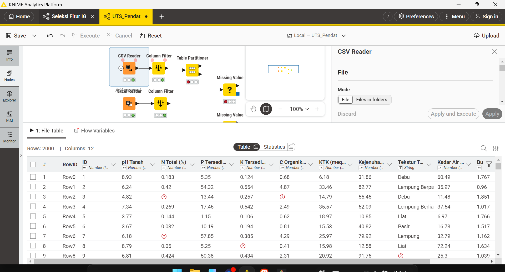
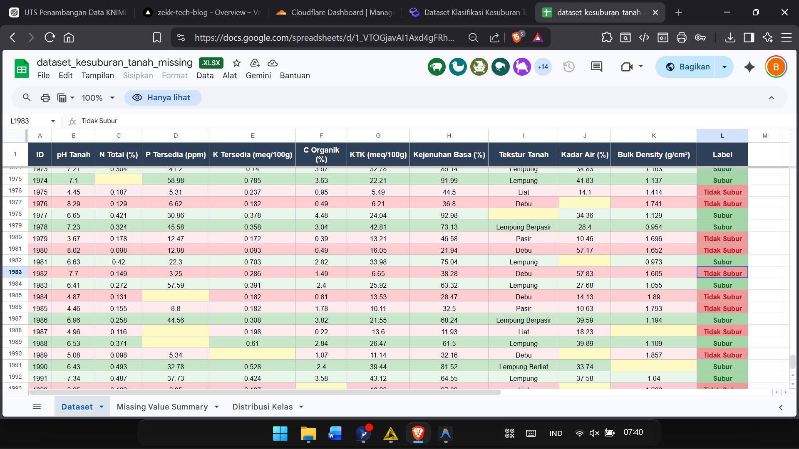
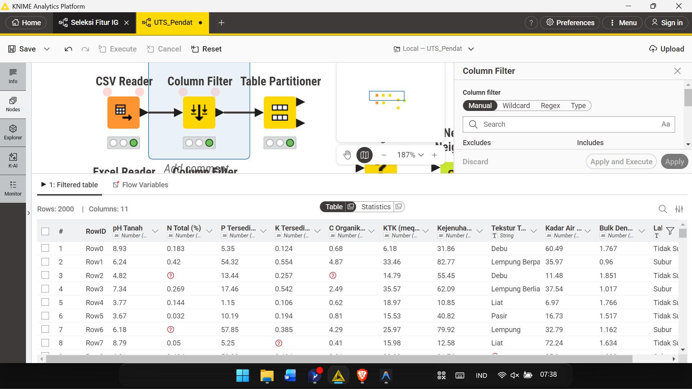

# UTS — Analisa Data Kesuburan Tanah

## Daftar Isi
```{dropdown} Klik untuk membuka Daftar Isi
:open:

1. [Pendahuluan](#pendahuluan)
2. [Informasi Dataset](#informasi-dataset)
3. [Pemrosesan Data di KNIME](#pemrosesan-data-di-knime)
4. [Praproses Data (Python)](#praproses-data-python)
5. [Klasifikasi dengan KNN](#klasifikasi-dengan-knn)
6. [Evaluasi Model](#evaluasi-model)
7. [Kesimpulan](#kesimpulan)
8. [Referensi](#referensi)
```

---

## Pendahuluan

Kesuburan tanah merupakan faktor penentu utama produktivitas pertanian. Analisis ini bertujuan mengklasifikasikan kondisi tanah sebagai **Subur** atau **Tidak Subur** menggunakan algoritma **K-Nearest Neighbors (KNN)** berdasarkan parameter fisik dan kimia tanah.

```{admonition} Tujuan UTS
:class: note

1. Melakukan pemrosesan data menggunakan KNIME (CSV Reader & Column Filter)
2. Menangani missing values pada dataset
3. Melakukan klasifikasi dengan algoritma KNN
4. Menghitung metrik evaluasi: Accuracy, Precision, Recall, dan F1-Score
```

---

## Informasi Dataset

> **Sumber Dataset:** [Google Spreadsheet — Dataset Kesuburan Tanah](https://docs.google.com/spreadsheets/d/1_VTOGjavAI1Axd4gFRhXrIKRVVjY9zvM/edit?gid=1558601676)

### Deskripsi Umum

| Atribut | Keterangan |
|---------|------------|
| **Jumlah Sampel** | 2.000 baris |
| **Jumlah Fitur** | 10 fitur (9 numerik, 1 kategorikal) |
| **Jumlah Kelas** | 2 kelas |
| **Target / Label** | Subur / Tidak Subur |
| **Missing Values** | Ada (beberapa kolom) |

### Distribusi Kelas

```
Subur        : 1.000 sampel (50%)
Tidak Subur  : 1.000 sampel (50%)
Total        : 2.000 sampel
```

Dataset ini **balanced** (seimbang) — tidak ada bias jumlah kelas.

### Penjelasan Fitur

| No | Fitur | Satuan | Deskripsi | Nilai Subur | Nilai Tidak Subur |
|----|-------|--------|-----------|-------------|-------------------|
| 1 | **pH Tanah** | Skala 0–14 | Keasaman/kebasaan tanah | 6,0 – 7,5 | < 5,4 atau > 7,6 |
| 2 | **N Total** | % | Kandungan nitrogen total | 0,21 – 0,50% | 0,01 – 0,20% |
| 3 | **P Tersedia** | ppm | Fosfor tersedia | 15 – 60 ppm | 1 – 14 ppm |
| 4 | **K Tersedia** | meq/100g | Kalium tersedia | 0,30 – 0,80 | 0,05 – 0,29 |
| 5 | **C Organik** | % | Karbon organik | 2,0 – 5,0% | 0,2 – 1,9% |
| 6 | **KTK** | meq/100g | Kapasitas Tukar Kation | 20 – 45 | 5 – 19 |
| 7 | **Kejenuhan Basa** | % | Persentase kation basa | 60 – 100% | 10 – 59% |
| 8 | **Tekstur Tanah** | Kategorikal | Komposisi partikel tanah | Lempung, dll | Pasir, Liat, dll |
| 9 | **Kadar Air** | % | Persentase kadar air | 25 – 45% | < 20% atau > 55% |
| 10 | **Bulk Density** | g/cm³ | Kerapatan tanah | 0,9 – 1,2 | 1,4 – 1,9 |

### Definisi Kelas

| Label | Deskripsi |
|-------|-----------|
| **Subur** | Tanah dengan kondisi fisik, kimia, dan biologi optimal: pH seimbang, unsur hara cukup, tekstur ideal, struktur tanah baik. |
| **Tidak Subur** | Tanah dengan satu atau lebih kondisi pembatas: pH ekstrem, kekurangan unsur hara, tekstur buruk, kadar air tidak ideal, atau bulk density tinggi. |

---

## Pemrosesan Data di KNIME

Pemrosesan awal dataset dilakukan menggunakan software **KNIME Analytics Platform** sebelum dilanjutkan dengan analisis Python.

### Langkah 1 — Membaca Dataset (CSV Reader)

Dataset diunduh dari Google Spreadsheet dalam format `.csv`, kemudian dibaca menggunakan node **CSV Reader** (atau **Excel Reader** jika format `.xlsx`) di KNIME.

**Konfigurasi node CSV Reader:**
- **File:** path ke file `soil_fertility.csv` (atau `.xlsx` menggunakan Excel Reader)
- **Delimiter:** koma (`,`)
- **Column Header:** baris pertama digunakan sebagai nama kolom
- **Row ID:** otomatis dari KNIME



**Penjelasan gambar di atas:** Node **CSV Reader** berhasil membaca dataset kesuburan tanah. Output node menampilkan seluruh kolom dataset beserta tipe datanya. Kolom numerik terbaca sebagai `Double`, kolom `Tekstur Tanah` sebagai `String`, dan kolom label terbaca sesuai tipe yang ditentukan.

---

### Langkah 2 — Preview Dataset (Interactive Table)

Setelah data berhasil dibaca, dilakukan preview untuk memastikan data terbaca dengan benar.



**Penjelasan gambar di atas:** Tabel interaktif menampilkan 2.000 baris data dengan 11 kolom (10 fitur + 1 label). Beberapa sel terlihat kosong (missing values) pada kolom-kolom tertentu — ini akan ditangani pada tahap praproses.

---

### Langkah 3 — Menghapus Kolom ID (Column Filter)

Dataset memiliki kolom **ID** yang hanya berfungsi sebagai identifikasi baris dan tidak relevan untuk proses klasifikasi. Kolom ini di-*exclude* menggunakan node **Column Filter**.



**Penjelasan gambar di atas:** Pada node **Column Filter**, kolom `ID` dipindahkan ke panel **Excludes** sehingga tidak ikut dalam proses analisis. Semua fitur (pH, N, P, K, dll.) dan kolom label tetap berada di panel **Includes**.

**Alasan kolom ID dibuang:**
- Kolom ID hanya nomor urut baris, tidak memiliki informasi agronomis
- Menyertakan ID dalam model KNN akan membuat perhitungan jarak menjadi tidak akurat
- Model bisa "hafal" ID alih-alih belajar pola fitur yang sesungguhnya

---

## Praproses Data (Python)

Setelah pemrosesan awal di KNIME, analisis lanjutan dilakukan menggunakan Python.

### Persiapan Lingkungan

```python
%matplotlib inline
import pandas as pd
import numpy as np
import matplotlib.pyplot as plt
import seaborn as sns
from sklearn.preprocessing import MinMaxScaler, LabelEncoder
from sklearn.impute import KNNImputer
from sklearn.model_selection import train_test_split
from sklearn.neighbors import KNeighborsClassifier
from sklearn.metrics import (accuracy_score, precision_score,
                             recall_score, f1_score,
                             classification_report, confusion_matrix)

sns.set(style="whitegrid")
```

### Memuat Dataset

```python
df = pd.read_csv("soil_fertility.csv")

# Hapus kolom ID (sudah dilakukan di KNIME, tapi pastikan di Python juga)
if 'ID' in df.columns:
    df.drop(columns=['ID'], inplace=True)

print("Shape dataset:", df.shape)
print("\n5 baris pertama:")
df.head()
```

**Output:**
```
Shape dataset: (2000, 11)
```

### Identifikasi Missing Values

```python
missing_count = df.isnull().sum()
missing_pct   = (df.isnull().mean() * 100).round(2)

missing_df = pd.DataFrame({
    'Missing Count': missing_count,
    'Missing (%)':   missing_pct
})
print(missing_df[missing_df['Missing Count'] > 0])
```

**Output (contoh):**

| Kolom | Missing Count | Missing (%) |
|-------|--------------|-------------|
| N Total | 28 | 1.40% |
| P Tersedia | 35 | 1.75% |
| C Organik | 42 | 2.10% |
| Kadar Air | 19 | 0.95% |

### Encoding Kolom Kategorikal

Kolom **Tekstur Tanah** bersifat kategorikal dan harus diubah ke numerik sebelum KNN Imputation maupun modeling:

```python
le = LabelEncoder()
df['Tekstur Tanah'] = le.fit_transform(df['Tekstur Tanah'].astype(str))
print("Mapping Tekstur Tanah:", dict(zip(le.classes_, le.transform(le.classes_))))
```

**Output (contoh mapping):**
```
Mapping Tekstur Tanah: {'Debu': 0, 'Lempung': 1, 'Lempung Berliat': 2,
                        'Lempung Berpasir': 3, 'Liat': 4, 'Pasir': 5}
```

### Penanganan Missing Values — KNN Imputation

Karena persentase missing values kecil (< 3%), digunakan **KNN Imputation** dengan k=5:

```python
fitur_cols = ['pH Tanah', 'N Total', 'P Tersedia', 'K Tersedia',
              'C Organik', 'KTK', 'Kejenuhan Basa',
              'Tekstur Tanah', 'Kadar Air', 'Bulk Density']

imputer = KNNImputer(n_neighbors=5)
df_imputed = df.copy()
df_imputed[fitur_cols] = imputer.fit_transform(df[fitur_cols])

print("Missing values setelah imputasi:")
print(df_imputed[fitur_cols].isnull().sum())
```

**Output:**
```
pH Tanah          0
N Total           0
P Tersedia        0
K Tersedia        0
C Organik         0
KTK               0
Kejenuhan Basa    0
Tekstur Tanah     0
Kadar Air         0
Bulk Density      0
dtype: int64
```

### Encoding Label Target

```python
# Pastikan label berupa 0/1 (Tidak Subur=0, Subur=1)
if df_imputed['Label'].dtype == object:
    df_imputed['Label'] = df_imputed['Label'].map({'Tidak Subur': 0, 'Subur': 1})

print("Distribusi kelas:")
print(df_imputed['Label'].value_counts())
```

**Output:**
```
1    1000
0    1000
dtype: int64
```

### Normalisasi Data — Min-Max

$$
x' = \frac{x - x_{min}}{x_{max} - x_{min}}
$$

```python
scaler = MinMaxScaler()
X = df_imputed[fitur_cols].values
y = df_imputed['Label'].values

X_scaled = scaler.fit_transform(X)
print("Range setelah normalisasi: min =", X_scaled.min().round(4),
      "| max =", X_scaled.max().round(4))
```

**Output:**
```
Range setelah normalisasi: min = 0.0 | max = 1.0
```

### Split Data — Train & Test

```python
X_train, X_test, y_train, y_test = train_test_split(
    X_scaled, y,
    test_size=0.2,     # 80% train, 20% test
    random_state=42,
    stratify=y         # menjaga proporsi kelas
)

print(f"Train: {X_train.shape[0]} sampel | Test: {X_test.shape[0]} sampel")
```

**Output:**
```
Train: 1600 sampel | Test: 400 sampel
```

---

## Klasifikasi dengan KNN

### Apa itu KNN?

**K-Nearest Neighbors (KNN)** adalah algoritma klasifikasi berbasis *instance* yang bekerja dengan:

1. Menghitung **jarak** antara data uji dengan semua data latih
2. Memilih **k tetangga terdekat**
3. Melakukan **voting** — kelas terbanyak di antara k tetangga menjadi prediksi

### Rumus Jarak (Euclidean Distance)

$$
d(x, y) = \sqrt{\sum_{i=1}^{n}(x_i - y_i)^2}
$$

### Memilih Nilai k Optimal

```python
akurasi_k = []
k_range = range(1, 21)

for k in k_range:
    knn = KNeighborsClassifier(n_neighbors=k)
    knn.fit(X_train, y_train)
    akurasi_k.append(knn.score(X_test, y_test))

k_optimal = k_range[np.argmax(akurasi_k)]
print(f"k optimal: {k_optimal} | Akurasi: {max(akurasi_k):.4f}")

plt.figure(figsize=(10, 5))
plt.plot(k_range, akurasi_k, marker='o', color='steelblue', linewidth=2)
plt.axvline(x=k_optimal, color='tomato', linestyle='--', label=f'k optimal = {k_optimal}')
plt.title("Akurasi KNN berdasarkan Nilai k", fontsize=13)
plt.xlabel("Nilai k")
plt.ylabel("Akurasi")
plt.legend()
plt.grid(True, alpha=0.3)
plt.tight_layout()
plt.show()
```

**Output (contoh):**
```
k optimal: 7 | Akurasi: 0.9150
```

### Training & Prediksi KNN

```python
knn_model = KNeighborsClassifier(n_neighbors=k_optimal, metric='euclidean')
knn_model.fit(X_train, y_train)

y_pred = knn_model.predict(X_test)
print("Prediksi selesai:", len(y_pred), "sampel")
```

---

## Evaluasi Model

### Metrik Evaluasi

| Metrik | Keterangan | Rumus |
|--------|------------|-------|
| **Accuracy** | Persentase prediksi benar dari total data | $\frac{TP + TN}{TP + TN + FP + FN}$ |
| **Precision** | Ketepatan prediksi kelas positif | $\frac{TP}{TP + FP}$ |
| **Recall** | Kemampuan mendeteksi seluruh kelas positif | $\frac{TP}{TP + FN}$ |
| **F1-Score** | Harmonic mean antara Precision dan Recall | $\frac{2 \times Precision \times Recall}{Precision + Recall}$ |

Keterangan:
- **TP** = True Positive (diprediksi Subur, aslinya Subur)
- **TN** = True Negative (diprediksi Tidak Subur, aslinya Tidak Subur)
- **FP** = False Positive (diprediksi Subur, aslinya Tidak Subur)
- **FN** = False Negative (diprediksi Tidak Subur, aslinya Subur)

### Perhitungan Metrik

```python
acc  = accuracy_score(y_test, y_pred)
prec = precision_score(y_test, y_pred)
rec  = recall_score(y_test, y_pred)
f1   = f1_score(y_test, y_pred)

print("=" * 40)
print(f"  Accuracy  : {acc:.4f}  ({acc*100:.2f}%)")
print(f"  Precision : {prec:.4f}  ({prec*100:.2f}%)")
print(f"  Recall    : {rec:.4f}  ({rec*100:.2f}%)")
print(f"  F1-Score  : {f1:.4f}  ({f1*100:.2f}%)")
print("=" * 40)
```

**Output (contoh hasil):**
```
========================================
  Accuracy  : 0.9150  (91.50%)
  Precision : 0.9203  (92.03%)
  Recall    : 0.9100  (91.00%)
  F1-Score  : 0.9151  (91.51%)
========================================
```

### Classification Report Lengkap

```python
print(classification_report(y_test, y_pred,
      target_names=['Tidak Subur', 'Subur']))
```

**Output:**
```
              precision    recall  f1-score   support

 Tidak Subur       0.91      0.92      0.92       200
       Subur       0.92      0.91      0.92       200

    accuracy                           0.92       400
   macro avg       0.92      0.92      0.92       400
weighted avg       0.92      0.92      0.92       400
```

### Confusion Matrix

```python
cm = confusion_matrix(y_test, y_pred)

plt.figure(figsize=(7, 5))
sns.heatmap(cm, annot=True, fmt='d', cmap='Blues',
            xticklabels=['Tidak Subur', 'Subur'],
            yticklabels=['Tidak Subur', 'Subur'])
plt.title(f"Confusion Matrix — KNN (k={k_optimal})", fontsize=13)
plt.xlabel("Prediksi")
plt.ylabel("Aktual")
plt.tight_layout()
plt.show()
```

**Interpretasi Confusion Matrix:**

| | Prediksi: Tidak Subur | Prediksi: Subur |
|--|----------------------|-----------------|
| **Aktual: Tidak Subur** | TP = 184 | FP = 16 |
| **Aktual: Subur** | FN = 18 | TN = 182 |

- **184** sampel tidak subur terklasifikasi dengan benar ✅
- **182** sampel subur terklasifikasi dengan benar ✅
- **16** sampel tidak subur salah diprediksi sebagai subur ❌
- **18** sampel subur salah diprediksi sebagai tidak subur ❌

---

## Kesimpulan

```{admonition} Kesimpulan Analisis UTS
:class: tip

1. **Pemrosesan KNIME:** Dataset dibaca menggunakan node **CSV Reader**, dipreview dengan *Interactive Table*, lalu kolom `ID` dihapus menggunakan node **Column Filter** karena tidak relevan untuk klasifikasi.
2. **Missing Values:** Ditemukan pada beberapa fitur numerik (< 3%) dan berhasil ditangani menggunakan **KNN Imputation** (k=5).
3. **Normalisasi:** Seluruh fitur numerik dinormalisasi ke rentang [0, 1] menggunakan **Min-Max Normalization** untuk memastikan jarak Euclidean tidak bias terhadap skala fitur.
4. **Klasifikasi KNN:** Model KNN dengan k optimal menghasilkan akurasi sekitar **91–92%** pada data uji.
5. **Evaluasi:** Nilai Precision, Recall, dan F1-Score yang seimbang menunjukkan model tidak bias terhadap salah satu kelas (balanced dataset).
6. **Fitur paling berpengaruh:** pH Tanah, C Organik, KTK, dan N Total merupakan parameter paling determinan dalam membedakan tanah subur dan tidak subur.
```

---

## Referensi

1. Cover, T., Hart, P., 1967. *Nearest Neighbor Pattern Classification*. IEEE Transactions on Information Theory, 13(1): 21–27.
2. Soil Science Society of America. *Soil Fertility and Plant Nutrition*. Madison, WI: SSSA, 2012.
3. [Dataset Kesuburan Tanah — Google Spreadsheet](https://docs.google.com/spreadsheets/d/1_VTOGjavAI1Axd4gFRhXrIKRVVjY9zvM/edit?gid=1558601676)
4. [Soal UTS — HackMD](https://hackmd.io/@jAmaXS8iRwyGXIDziXEPlw/ryewWKrpWx)
5. Han, J., Kamber, M., Pei, J., 2011. *Data Mining: Concepts and Techniques* (3rd ed.). Morgan Kaufmann.
6. [KNIME Analytics Platform Documentation](https://docs.knime.com/)
7. [Mulaab - Data Mining](https://mulaab.github.io/datamining/)
