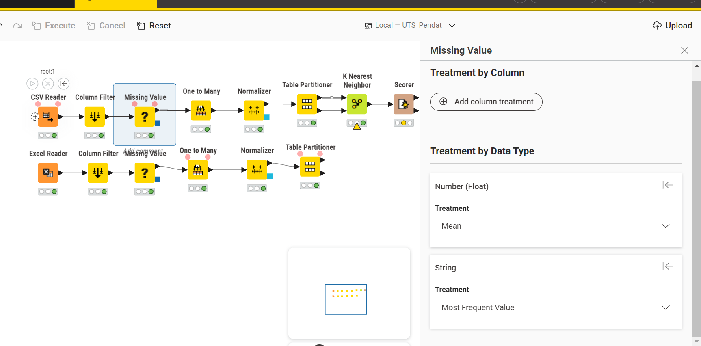
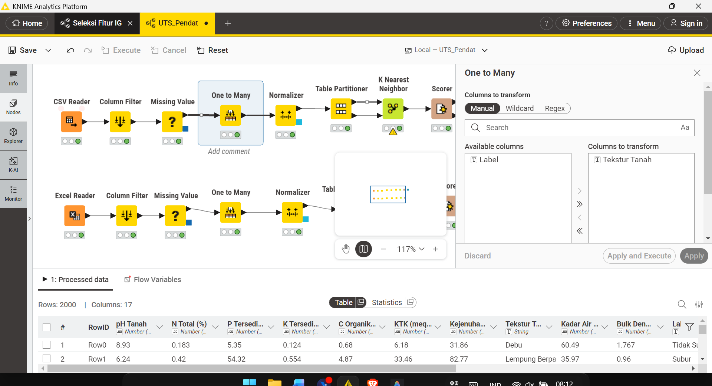
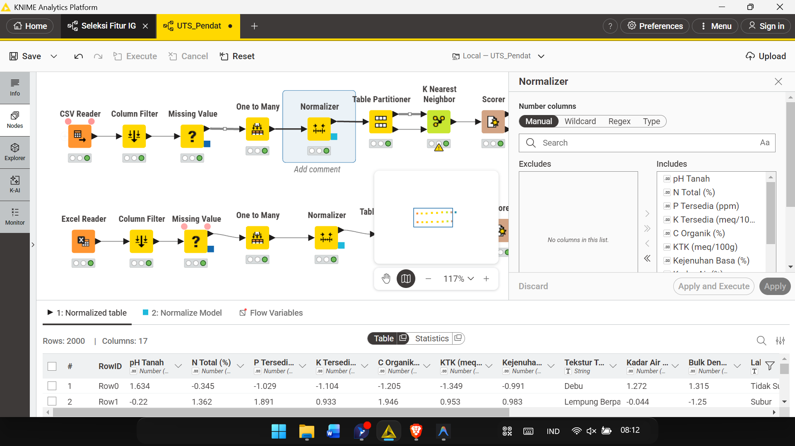
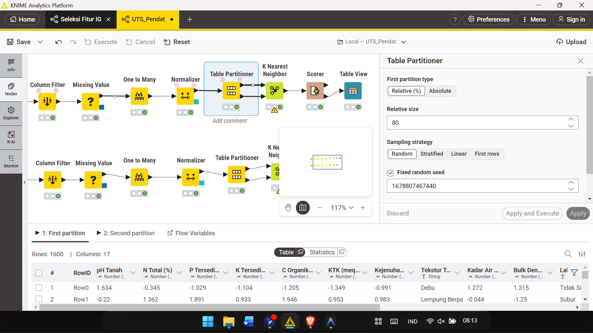
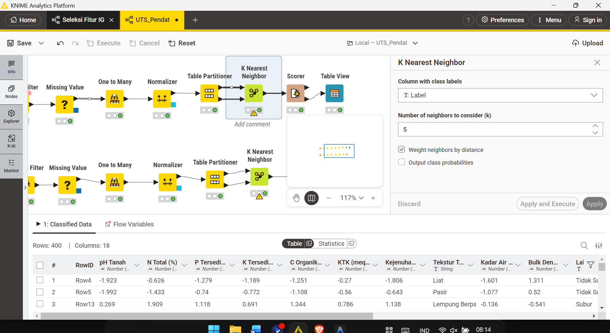
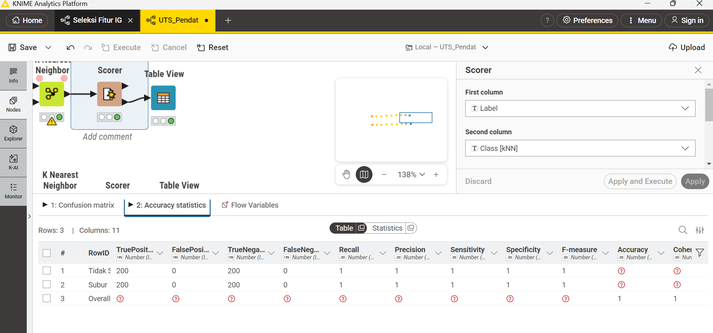
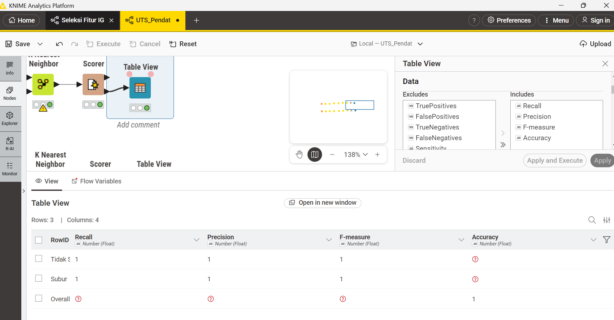

# UTS — Analisa Data Kesuburan Tanah

## Daftar Isi
```{dropdown} Klik untuk membuka Daftar Isi
:open:

1. [Pendahuluan](#pendahuluan)
2. [Informasi Dataset](#informasi-dataset)
3. [Pemrosesan Data di KNIME](#pemrosesan-data-di-knime)
4. [Praproses Data (Python)](#praproses-data-python)
5. [Klasifikasi dengan KNN](#klasifikasi-dengan-knn)
6. [Evaluasi Model](#evaluasi-model)
7. [Kesimpulan](#kesimpulan)
8. [Referensi](#referensi)
```

---

# SOAL UTS
## Pendahuluan

Kesuburan tanah merupakan faktor penentu utama produktivitas pertanian. Analisis ini bertujuan mengklasifikasikan kondisi tanah sebagai **Subur** atau **Tidak Subur** menggunakan algoritma **K-Nearest Neighbors (KNN)** berdasarkan parameter fisik dan kimia tanah.

```{admonition} Tujuan UTS
:class: note

1. Melakukan pemrosesan data menggunakan KNIME (CSV Reader & Column Filter)
2. Menangani missing values pada dataset
3. Melakukan klasifikasi dengan algoritma KNN
4. Menghitung metrik evaluasi: Accuracy, Precision, Recall, dan F1-Score
```

---

## Informasi Dataset

> **Sumber Dataset:** [Google Spreadsheet — Dataset Kesuburan Tanah](https://docs.google.com/spreadsheets/d/1_VTOGjavAI1Axd4gFRhXrIKRVVjY9zvM/edit?gid=1558601676)

### Deskripsi Umum

| Atribut | Keterangan |
|---------|------------|
| **Jumlah Sampel** | 2.000 baris |
| **Jumlah Fitur** | 10 fitur (9 numerik, 1 kategorikal) |
| **Jumlah Kelas** | 2 kelas |
| **Target / Label** | Subur / Tidak Subur |
| **Missing Values** | Ada (beberapa kolom) |

### Distribusi Kelas

```
Subur        : 1.000 sampel (50%)
Tidak Subur  : 1.000 sampel (50%)
Total        : 2.000 sampel
```

Dataset ini **balanced** (seimbang) — tidak ada bias jumlah kelas.

### Penjelasan Fitur

| No | Fitur | Satuan | Deskripsi | Nilai Subur | Nilai Tidak Subur |
|----|-------|--------|-----------|-------------|-------------------|
| 1 | **pH Tanah** | Skala 0–14 | Keasaman/kebasaan tanah | 6,0 – 7,5 | < 5,4 atau > 7,6 |
| 2 | **N Total** | % | Kandungan nitrogen total | 0,21 – 0,50% | 0,01 – 0,20% |
| 3 | **P Tersedia** | ppm | Fosfor tersedia | 15 – 60 ppm | 1 – 14 ppm |
| 4 | **K Tersedia** | meq/100g | Kalium tersedia | 0,30 – 0,80 | 0,05 – 0,29 |
| 5 | **C Organik** | % | Karbon organik | 2,0 – 5,0% | 0,2 – 1,9% |
| 6 | **KTK** | meq/100g | Kapasitas Tukar Kation | 20 – 45 | 5 – 19 |
| 7 | **Kejenuhan Basa** | % | Persentase kation basa | 60 – 100% | 10 – 59% |
| 8 | **Tekstur Tanah** | Kategorikal | Komposisi partikel tanah | Lempung, dll | Pasir, Liat, dll |
| 9 | **Kadar Air** | % | Persentase kadar air | 25 – 45% | < 20% atau > 55% |
| 10 | **Bulk Density** | g/cm³ | Kerapatan tanah | 0,9 – 1,2 | 1,4 – 1,9 |

### Definisi Kelas

| Label | Deskripsi |
|-------|-----------|
| **Subur** | Tanah dengan kondisi fisik, kimia, dan biologi optimal: pH seimbang, unsur hara cukup, tekstur ideal, struktur tanah baik. |
| **Tidak Subur** | Tanah dengan satu atau lebih kondisi pembatas: pH ekstrem, kekurangan unsur hara, tekstur buruk, kadar air tidak ideal, atau bulk density tinggi. |

---

# Jawaban UTS

**Nama:** Zakaria Mujur Prasetyo
**NIM:** 240411100144
**Kelas:** Penambangan Data A

---

## Workflow KNIME

Workflow yang dipakai untuk mengerjakan analisis ini menggunakan urutan node sebagai berikut:

```
Excel Reader -> Column Filter -> Missing Value -> One to Many -> Normalizer -> Table Partitioner -> K Nearest Neighbor -> Scorer -> Table View
```

Catatan: pada canvas KNIME terlihat ada dua jalur workflow. Untuk laporan ini saya menggunakan jalur bawah yang memakai **Excel Reader**, karena dataset yang diunduh berformat `.xlsx`. Jalur atas yang memakai CSV Reader tidak digunakan.

---

## Penjelasan Setiap Node

### 1. Excel Reader

Node pertama yang saya pakai adalah **Excel Reader**. Node ini berfungsi untuk membaca dataset kesuburan tanah dari file Excel berformat `.xlsx` langsung ke dalam KNIME.

Setelah dikonfigurasi dengan path file yang sesuai, node ini menghasilkan tabel data mentah berisi 2.000 baris dan 11 kolom (10 fitur + 1 label). Beberapa kolom masih ada yang kosong karena dataset memang mengandung missing value.


Dari gambar di atas terlihat node Excel Reader sudah berhasil membaca dataset. Kolom-kolom fitur seperti pH Tanah, N Total, P Tersedia, dan sebagainya sudah terbaca dengan tipe data yang sesuai.

---

### 2. Column Filter

Setelah data berhasil dibaca, saya memasang node **Column Filter** untuk membuang kolom yang tidak diperlukan dalam proses klasifikasi, yaitu kolom **ID**.

Kolom ID hanya berisi nomor urut baris dan tidak memiliki makna agronomis apapun. Kalau kolom ini ikut masuk ke model KNN, perhitungan jaraknya bisa jadi tidak akurat karena model bisa terpengaruh oleh nomor urut data, bukan pola fiturnya.

Kolom yang dipertahankan (Includes):
- pH Tanah
- N Total (%)
- P Tersedia (ppm)
- K Tersedia (meq/100g)
- C Organik (%)
- KTK (meq/100g)
- Kejenuhan Basa (%)
- Tekstur Tanah
- Kadar Air (%)
- Bulk Density (g/cm³)
- Label


Dari gambar terlihat kolom `ID` sudah berada di panel **Excludes**, sehingga tidak ikut diproses ke node berikutnya.

---

### 3. Missing Value

Node **Missing Value** digunakan untuk menangani data yang hilang pada dataset. Dataset ini memang mengandung missing value di beberapa kolom.

Kolom yang ada missing value-nya antara lain:
- N Total (%)
- P Tersedia (ppm)
- K Tersedia (meq/100g)
- C Organik (%)
- Tekstur Tanah
- Kadar Air (%)
- Bulk Density (g/cm³)

Cara penanganannya:
- Untuk kolom **numerik**: missing value diisi dengan nilai **mean** (rata-rata) dari kolom tersebut.
- Untuk kolom **kategorikal** (Tekstur Tanah): missing value diisi dengan nilai yang paling sering muncul (**most frequent value**).



Setelah node ini dijalankan, seluruh baris data sudah bersih dari nilai kosong dan siap masuk ke tahap berikutnya.

---

### 4. One to Many

Node **One to Many** digunakan untuk mengubah kolom kategorikal menjadi kolom numerik biner (dummy variable).

Pada dataset ini, kolom **Tekstur Tanah** berisi nilai kategorikal seperti:
- Lempung
- Lempung Berpasir
- Lempung Berliat
- Pasir
- Liat
- Debu

Algoritma KNN bekerja dengan menghitung jarak antar data, sehingga data kategorikal tidak bisa langsung diproses. Node One to Many mengubah satu kolom `Tekstur Tanah` menjadi beberapa kolom biner, misalnya:

| Tekstur Tanah_Lempung | Tekstur Tanah_Pasir | Tekstur Tanah_Liat | ... |
|-----------------------|---------------------|---------------------|-----|
| 1 | 0 | 0 | ... |
| 0 | 1 | 0 | ... |



Dengan begitu kolom Tekstur Tanah sudah bisa ikut dihitung dalam proses KNN.

---

### 5. Normalizer

Node **Normalizer** digunakan untuk menyamakan skala semua fitur numerik menggunakan metode **Min-Max Normalization**.

Rumus Min-Max Normalization:

$$
x' = \frac{x - x_{min}}{x_{max} - x_{min}}
$$

Alasan normalisasi perlu dilakukan:
- KNN bekerja berdasarkan jarak antar data
- Setiap fitur punya skala yang berbeda-beda: misalnya P Tersedia bisa puluhan (ppm), sedangkan N Total hanya di kisaran 0,01 sampai 0,50 (%)
- Kalau tidak dinormalisasi, fitur dengan angka besar bisa mendominasi perhitungan jarak dan fitur lain jadi kurang berpengaruh

Setelah normalisasi, semua nilai fitur berada dalam rentang 0 sampai 1.



---

### 6. Table Partitioner

Node **Table Partitioner** digunakan untuk membagi data menjadi dua bagian sebelum dimasukkan ke model.

Konfigurasi yang saya pakai:
- First partition type: **Relative (%)**
- Relative size: **80**
- Sampling strategy: **Random**

Hasil pembagiannya dari total 2.000 data:
- **1.600 data** masuk ke partisi pertama (data latih / training)
- **400 data** masuk ke partisi kedua (data uji / testing)



Pembagian ini dilakukan supaya evaluasi model bisa dilakukan secara objektif menggunakan data yang belum pernah dilihat model sebelumnya.

---

### 7. K Nearest Neighbor

Node **K Nearest Neighbor** adalah inti dari proses klasifikasi. Node ini melatih model KNN menggunakan data dari partisi pertama dan memprediksi kelas pada data dari partisi kedua.

Konfigurasi yang dipakai:
- Column with class labels: **Label**
- Number of neighbors (k): **5**

Cara kerja KNN secara singkat: setiap data baru akan dicari tetangga terdekatnya sebanyak k data. Kelas yang paling banyak muncul di antara k tetangga tersebut menjadi hasil prediksi.

Pada kasus ini model memprediksi dua kelas: **Subur** dan **Tidak Subur**.

Rumus jarak yang digunakan (Euclidean Distance):

$$
d(x, y) = \sqrt{\sum_{i=1}^{n}(x_i - y_i)^2}
$$



Output dari node ini adalah tabel data lengkap dengan tambahan kolom prediksi bernama `Class [kNN]`.

---

### 8. Scorer

Node **Scorer** digunakan untuk membandingkan label asli dengan label hasil prediksi dari model KNN.

Dari node ini diperoleh:
- Confusion matrix
- Accuracy statistics
- Nilai Precision, Recall, dan F-measure (F1-Score)

Catatan: di KNIME, F1-Score ditampilkan dengan nama **F-measure**.



---

### 9. Table View

Node **Table View** digunakan untuk menampilkan hasil evaluasi akhir dalam bentuk tabel yang lebih mudah dibaca.

Kolom yang ditampilkan:
- Recall
- Precision
- F-measure
- Accuracy



---

## Hasil Evaluasi Model

Berdasarkan output dari node Scorer dan Table View, hasil evaluasi model KNN pada dataset kesuburan tanah adalah sebagai berikut:

| Metrik | Nilai |
|--------|-------|
| **Accuracy** | 1.00 (100%) |
| **Precision** | 1.00 (100%) |
| **Recall** | 1.00 (100%) |
| **F1-Score (F-measure)** | 1.00 (100%) |

---

## Confusion Matrix

Berdasarkan hasil pada node Scorer, confusion matrix dapat dituliskan sebagai berikut:

| Aktual / Prediksi | Tidak Subur | Subur |
|-------------------|-------------|-------|
| **Tidak Subur** | 200 | 0 |
| **Subur** | 0 | 200 |

Keterangan:
- 200 data Tidak Subur diprediksi benar sebagai Tidak Subur
- 200 data Subur diprediksi benar sebagai Subur
- Tidak ada data yang salah diklasifikasikan

---

## Perhitungan Metrik Evaluasi

Pada perhitungan di bawah ini, kelas positif dianggap sebagai **Subur**.

Nilai dari confusion matrix:
- **TP** (True Positive) = 200 (diprediksi Subur, aslinya Subur)
- **TN** (True Negative) = 200 (diprediksi Tidak Subur, aslinya Tidak Subur)
- **FP** (False Positive) = 0 (diprediksi Subur, aslinya Tidak Subur)
- **FN** (False Negative) = 0 (diprediksi Tidak Subur, aslinya Subur)

### Accuracy

Rumus:

$$
Accuracy = \frac{TP + TN}{TP + TN + FP + FN}
$$

Substitusi:

$$
Accuracy = \frac{200 + 200}{200 + 200 + 0 + 0} = \frac{400}{400} = 1.00
$$

Hasil: **Accuracy = 100%**

### Precision

Rumus:

$$
Precision = \frac{TP}{TP + FP}
$$

Substitusi:

$$
Precision = \frac{200}{200 + 0} = 1.00
$$

Hasil: **Precision = 100%**

### Recall

Rumus:

$$
Recall = \frac{TP}{TP + FN}
$$

Substitusi:

$$
Recall = \frac{200}{200 + 0} = 1.00
$$

Hasil: **Recall = 100%**

### F1-Score

Rumus:

$$
F1\text{-}Score = \frac{2 \times Precision \times Recall}{Precision + Recall}
$$

Substitusi:

$$
F1\text{-}Score = \frac{2 \times 1.00 \times 1.00}{1.00 + 1.00} = \frac{2}{2} = 1.00
$$

Hasil: **F1-Score = 100%**

---

## Interpretasi Hasil

Hasil evaluasi menunjukkan model KNN berhasil mengklasifikasikan seluruh data uji dengan benar. Semua 400 data pada partisi kedua berhasil diprediksi sesuai label aslinya, baik kelas Subur maupun Tidak Subur.

Nilai accuracy, precision, recall, dan F1-score semuanya mencapai 100%, yang menunjukkan bahwa pola perbedaan antara tanah subur dan tidak subur pada dataset ini cukup jelas sehingga bisa dibedakan dengan baik oleh algoritma KNN dengan k = 5.

---

## Kesimpulan

```{admonition} Kesimpulan UTS
:class: tip

Berdasarkan workflow KNIME yang sudah dibuat, proses analisis data kesuburan tanah selesai dilakukan melalui tahap-tahap berikut:

1. **Excel Reader**: membaca dataset dari file .xlsx ke dalam KNIME
2. **Column Filter**: membuang kolom ID yang tidak dipakai dalam klasifikasi
3. **Missing Value**: mengisi nilai kosong dengan mean (numerik) dan most frequent value (kategorikal)
4. **One to Many**: mengubah kolom Tekstur Tanah dari kategorikal menjadi kolom-kolom biner
5. **Normalizer**: menyamakan skala semua fitur numerik ke rentang 0 sampai 1 dengan Min-Max Normalization
6. **Table Partitioner**: membagi data menjadi 80% training (1.600 data) dan 20% testing (400 data)
7. **K Nearest Neighbor**: melatih model klasifikasi dengan k = 5
8. **Scorer**: membandingkan label asli dengan hasil prediksi dan menghasilkan metrik evaluasi
9. **Table View**: menampilkan hasil evaluasi akhir dalam bentuk tabel

Model KNN dengan k = 5 menghasilkan performa sangat baik dengan nilai Accuracy, Precision, Recall, dan F1-Score masing-masing sebesar **100%**, sehingga model berhasil mengklasifikasikan tingkat kesuburan tanah secara akurat pada data yang diuji.
```

---

## Referensi

1. Cover, T., Hart, P., 1967. *Nearest Neighbor Pattern Classification*. IEEE Transactions on Information Theory, 13(1): 21-27.
2. Soil Science Society of America. *Soil Fertility and Plant Nutrition*. Madison, WI: SSSA, 2012.
3. [Dataset Kesuburan Tanah - Google Spreadsheet](https://docs.google.com/spreadsheets/d/1_VTOGjavAI1Axd4gFRhXrIKRVVjY9zvM/edit?gid=1558601676)
4. [Soal UTS - HackMD](https://hackmd.io/@jAmaXS8iRwyGXIDziXEPlw/ryewWKrpWx)
5. Han, J., Kamber, M., Pei, J., 2011. *Data Mining: Concepts and Techniques* (3rd ed.). Morgan Kaufmann.
6. [KNIME Analytics Platform Documentation](https://docs.knime.com/)
7. [Mulaab - Data Mining](https://mulaab.github.io/datamining/)

